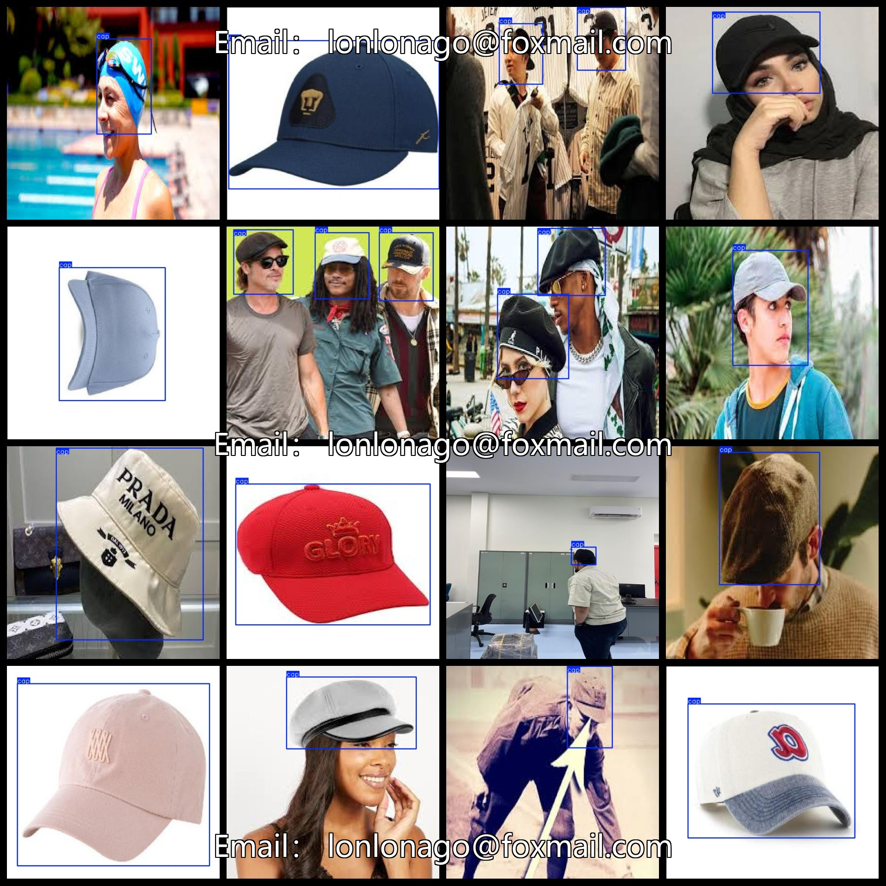

# Hat Dataset 1852 imagesVOC+YOLO

Hat Dataset 1852stretchVOC+YOLO

Dataset format: Pascal VOC format + YOLO format (the txt file does not contain the split path, it only contains jpg images and corresponding VOC format xml files and yolo format txt files)

Number of Images (Total jpg Files): 1852

Number of xml files: 1852

Number of txt files: 1852

Number of categories: 1

The Github repository is: datasets_sl

Caps: ["cap"]

Number of boxes labeled in each category:

Cap frame count = 2528

Total frames count: 2528

Number of images per category:

Cap occupies the number of pictures = 1852

Image resolution: 640x640

Use the labeling tool: labelImg

Dataset Augmentation: No

Rules for annotation: Draw a rectangle around the category.

Important note: The dataset does not have been divided into training, validation, and testing sets.

Special Disclaimer: This dataset does not guarantee the accuracy of the trained models or weight files.

Annotation and image details are as follows:

## Images

---

Here is a pay link on Stripe (https://buy.stripe.com/3cs8yP7sY87d0vu9AB). Please contact me lonlonago@foxmail.com after funding $89, and I will send you a complete data files, thank you!

